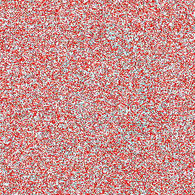

# Whodunit





## A Murder Most Foul

Welcome to Tudor Mansion. Your host, Mr. John Boddy, has met an untimely end—he's the victim of foul play. It is your job to determine whodunit (i.e., who has done it).

Unfortunately for you (though even more unfortunately for Mr. Boddy), the only evidence you have is a 24-bit BMP file called `clue.bmp`, pictured below, that Mr. Boddy whipped up on his computer in his final moments. Hidden among this file's red "noise" is a drawing of whodunit.



You long ago threw away that [piece of red plastic](http://www.stitchcraftcreations.com/2010/06/10/secret-agent-kit/) from your (or, at least, my) childhood that you could hold in front of this clue to solve this mystery for you, and so you must attack it as a computer scientist instead.

But, first, some background.



## Bitmaps

Perhaps the simplest way to represent an image is with a grid of pixels (i.e., dots), each of which can be of a different color. For black-and-white images, we thus need 1 bit per pixel, as 0 could represent black and 1 could represent white, as in the below.


In this sense, then, is an image just a bitmap (i.e., a map of bits). For more colorful images, you simply need more bits per pixel. A file format (like [GIF](https://en.wikipedia.org/wiki/GIF)) that supports "8-bit color" uses 8 bits per pixel. A file format (like [BMP](https://en.wikipedia.org/wiki/BMP_file_format), [JPEG](https://en.wikipedia.org/wiki/JPEG), or [PNG](https://en.wikipedia.org/wiki/Portable_Network_Graphics)) that supports "24-bit color" uses 24 bits per pixel. (BMP actually supports 1-, 4-, 8-, 16-, 24-, and 32-bit color.)

A 24-bit BMP like Mr. Boddy's uses 8 bits to signify the amount of red in a pixel's color, 8 bits to signify the amount of green in a pixel's color, and 8 bits to signify the amount of blue in a pixel's color. If you've ever heard of RGB color, well, there you have it: red, green, blue.

If the R, G, and B values of some pixel in a BMP are, say, `0xff`, `0x00`, and `0x00` in hexadecimal, that pixel is purely red, as `0xff` (otherwise known as `255` in decimal) implies "a lot of red," while `0x00` and `0x00` imply "no green" and "no blue," respectively. Given how red Mr. Boddy's BMP is, it clearly has a lot of pixels with those RGB values. But it also has a few with other values.

Incidentally, HTML and CSS (languages in which webpages can be written) model [colors](https://en.wikipedia.org/wiki/Web_colors) in this same way.



## A Bit(map) More Technical

Recall that a file is just a sequence of bits, arranged in some fashion. A 24-bit BMP file, then, is essentially just a sequence of bits, (almost) every 24 of which happen to represent some pixel's color. But a BMP file also contains some "metadata," information like an image's height and width. That metadata is stored at the beginning of the file in the form of two data structures generally referred to as "headers," not to be confused with C's header files. The first of these headers, called `BITMAPFILEHEADER`, is 14 bytes long. (Recall that 1 byte equals 8 bits.) The second of these headers, called `BITMAPINFOHEADER`, is 40 bytes long. Immediately following these headers is the actual bitmap: an array of bytes, triples of which represent a pixel's color. (In 1-, 4-, and 16-bit BMPs, but not 24- or 32-, there's an additional header right after `BITMAPINFOHEADER` called `RGBQUAD`, an array that defines "intensity values" for each of the colors in a device's palette.) However, BMP stores these triples backwards (i.e., as BGR), with 8 bits for blue, followed by 8 bits for green, followed by 8 bits for red. (Some BMPs also store the entire bitmap backwards, with an image's top row at the end of the BMP file. But we've stored this problem set's BMPs as described herein, with each bitmap's top row first and bottom row last.) In other words, were we to convert the 1-bit smiley above to a 24-bit smiley, substituting red for black, a 24-bit BMP would store this bitmap as follows, where `0000ff` signifies red and `ffffff` signifies white; we've highlighted in red and bolded all instances of `0000ff`.

<div style="font-family: courier">
ffffff  ffffff  <span style="color:red;font-weight:bold">0000ff</span>  <span style="color:red;font-weight:bold">0000ff</span>  <span style="color:red;font-weight:bold">0000ff</span>  <span style="color:red;font-weight:bold">0000ff</span>  ffffff  ffffff<br/>
ffffff  <span style="color:red;font-weight:bold">0000ff</span>  ffffff  ffffff  ffffff  ffffff  <span style="color:red;font-weight:bold">0000ff</span>  ffffff<br/>
<span style="color:red;font-weight:bold">0000ff</span>  ffffff  <span style="color:red;font-weight:bold">0000ff</span>  ffffff  ffffff  <span style="color:red;font-weight:bold">0000ff</span>  ffffff  <span style="color:red;font-weight:bold">0000ff</span><br/>
<span style="color:red;font-weight:bold">0000ff</span>  ffffff  ffffff  ffffff  ffffff  ffffff  ffffff  <span style="color:red;font-weight:bold">0000ff</span><br/>
<span style="color:red;font-weight:bold">0000ff</span>  ffffff  <span style="color:red;font-weight:bold">0000ff</span>  ffffff  ffffff  <span style="color:red;font-weight:bold">0000ff</span>  ffffff  <span style="color:red;font-weight:bold">0000ff</span><br/>
<span style="color:red;font-weight:bold">0000ff</span>  ffffff  ffffff  <span style="color:red;font-weight:bold">0000ff</span>  <span style="color:red;font-weight:bold">0000ff</span>  ffffff  ffffff  <span style="color:red;font-weight:bold">0000ff</span><br/>
ffffff  <span style="color:red;font-weight:bold">0000ff</span>  ffffff  ffffff  ffffff  ffffff  <span style="color:red;font-weight:bold">0000ff</span>  ffffff<br/>
ffffff  ffffff  <span style="color:red;font-weight:bold">0000ff</span>  <span style="color:red;font-weight:bold">0000ff</span>  <span style="color:red;font-weight:bold">0000ff</span>  <span style="color:red;font-weight:bold">0000ff</span>  ffffff  ffffff
</div>

Because we've presented these bits from left to right, top to bottom, in 8 columns, you can actually see the red smiley if you take a step back or squint a bit! And to be clear, recall that a hexadecimal digit represents 4 bits. Accordingly, `ffffff` in hexadecimal actually signifies `111111111111111111111111` in binary.



## Copycat

Let's now explore the underlying nature of these bitmaps in C. In `copy.c` at right is a program whose sole purpose in life is to create a copy of a BMP.

Go ahead and compile `copy.c` into a program called `copy` using `make`. (Remember how?) Then execute a command like the below.

```
./copy smiley.bmp copy.bmp
```

If you then execute `ls -l`, you should see that `smiley.bmp` and `copy.bmp` are indeed the same size. Let's double-check that they're actually the same! Execute the below.

```
diff smiley.bmp copy.bmp
```

If that command tells you nothing, the files are indeed identical. (Note that some programs, like Photoshop, include trailing zeroes at the ends of some BMPs. Our version of `copy` throws those away, so don't be too worried if you try to copy a BMP that you've downloaded or made only to find that the copy is actually a few bytes smaller than the original.) Feel free to open both files (as by double-clicking each) to confirm as much visually. But `diff` does a byte-by-byte comparison, so its eye is probably sharper than yours!



## Structurally Sound

So how now did that copy get made? You'll notice that `copy.c` relies on another file `bmp.h`. Click on the little folder icon near the top of the lab window to open the file browser, and double-click on `bmp.h` to open it up and have a look.

Open up `bmp.h`, and you'll see actual definitions of those headers we've mentioned, adapted from Microsoft's own implementations thereof. In addition, that file defines `BYTE`, `DWORD`, `LONG`, and `WORD`, data types normally found in the world of Windows programming. Notice how they're just aliases for primitives with which you are (hopefully) already familiar. It appears that `BITMAPFILEHEADER` and `BITMAPINFOHEADER` make use of these types. This file also defines a `struct` called `RGBTRIPLE` that, quite simply, "encapsulates" three bytes: one blue, one green, and one red (the order, recall, in which we expect to find RGB triples actually on disk).

Why are these `struct`s useful? Well, recall that a file is just a sequence of bytes (or, ultimately, bits) on disk. But those bytes are generally ordered in such a way that the first few represent something, the next few represent something else, and so on. "File formats" exist because the world has standardized what bytes mean what. Now, we could just read a file from disk into RAM as one big array of bytes. And we could just remember that the byte at `array[i]` represents one thing, while the byte at `array[j]` represents another. But why not give some of those bytes names so that we can retrieve them from memory more easily? That's precisely what the structs in `bmp.h` allow us to do. Rather than think of some file as one long sequence of bytes, we can instead think of it as a sequence of `struct`s.

Recall that `smiley.bmp` is 8 by 8 pixels, and so it should take up 14 + 40 + (8 × 8) × 3 = 246 bytes on disk. (Confirm as much if you'd like using `ls -l`.) Here's what it thus looks like on disk according to Microsoft:


As this figure suggests, order does matter when it comes to `struct`s' members. Byte 57 is `rgbtBlue` (and not, say, `rgbtRed`), because `rgbtBlue` is defined first in `RGBTRIPLE`. Our use, incidentally, of the attribute called `packed` ensures that `clang` does not try to "word-align" members (whereby the address of each member's first byte is a multiple of 4), lest we end up with "gaps" in our structs that don't actually exist on disk. No need to worry about that particular implementation detail, though.



## Q&A

Go ahead and pull up the URLs to which `BITMAPFILEHEADER` and `BITMAPINFOHEADER` are attributed, per the comments in `bmp.h`. Rather than hold your hand further on a stroll through `copy.c`, we're instead going to ask you some questions and let you teach yourself how the code therein works.

Open up `questions.md` and replace every `TODO` therein with your answer to the question above it. That file happens to be written in Markdown, a lightweight format for text files that makes it easy to stylize text. For instance, we've prefixed each question with `##` so that, when viewed on GitHub, it renders in a larger, bold font. And we've surrounded code-related keywords with backticks so that they render on GitHub in a monospaced (i.e., code-like) font.

No need to write your answers in Markdown; plain text suffices. But if you'd like to format your answers somehow, see [this tutorial](https://guides.github.com/features/mastering-markdown/).



## Manipulating the Bitmap

Let's finally write a few lines of code to see how we can manipulate images. First, let's create the program we ultimately want to write for this lab, called Whodunit. Seems like `copy.c` would make a great place to start, so why don't we go ahead and copy that file using the terminal's `cp` command:

```
cp copy.c whodunit.c
```

Then, go ahead and click the little folder icon near the top left of your lab environment to open the file browser and double-click on the newly created `whodunit.c`. The interesting lines of code in `copy.c`, where the copying work itself actually happened, are lines 75 and 78, where the program reads from the source file and writes to the destination file, respectively, one `RGBTRIPLE`s worth of data.

Instead of reading the source file's `RGBTRIPLE`, let's just write our own. Go ahead and delete line 75 and its associated comment. In place of what you just deleted, can you think of a way to define what a <span style="color:purple;font-weight:bold">purple</span> pixel might look like? Let's just write a purple pixel in place of every pixel in the original source. It turns out, the hexadecimal color code for purple is `800080`. When you think you've got it, compile `whodunit` and run

```
./whodunit clue.bmp verdict.bmp
```

and double-click on the resulting image to hopefully see a wall of purple!



<ul>
  <li>Because of <code>bmp.h</code>, <code>RGBTRIPLE</code> is just a new data type we can work with, like <code>int</code> or <code>float</code>.</li>
  <li>If we have a variable of type <code>RGBTRIPLE</code>, we can access its properties, such as <code>rgbtRed</code>, using dot notation.</li>
  <li>Recall that <code>triple</code> is a variable of type <code>RGBTRIPLE</code>.</li>
  <li>Recall that we can introduce a number in hexadecimal format in C by prepending it with <code>0x</code>.</li>
  <li>Recall that a pixel can be defined as having a red, green, and blue component (RGB).</li>
  <li>Recall that the first two hexdigits of a hexadecimal color code refer to its red component, the second two to its green component, and the third two to its blue component.</li>
</ul>

Make sure you've tried on your own first, before viewing the below!


<code>
triple.rgbtRed = 0x80;<br />
triple.rgbtGreen = 0x00;<br />
triple.rgbtBlue = 0x80;
</code>





## Digital Detective

Now, instead of just ignoring the pixels in the source file, let's actually do something with them. Head back over to `copy.c` to get a copy of the lines you deleted in the last example, and paste them back where they belong in `whodunit.c`. Perhaps, to help Mr. Boddy, we can try and change the pixels at some point between reading from the source and writing to the destination?

What if, perhaps. we wanted to turn all of the white pixels black, reasoning that the higher contrast might make for better readability? Or what if we just wanted to turn white all of that red "noise" in the image? Or if we wanted to better-simulate the idea of that red piece of plastic, and give everything a reddish shade? We can use some conditional logic, perhaps, to check the different properties of `triple` first, and then decide what to do with it based on evaluating that boolean expression.

This is your final challenge for now--do it for Mr. Boddy! If you succeed, then after recompiling your code,

```
./whodunit clue.bmp verdict.bmp
```

should reveal the answer to this mystery!



<ul>
  <li>Recall that we can create more complex boolean expressions using <code>&&</code> and <code>||</code>.</li>
  <li>Recall that <code>==</code> tests for equality, though <code><=</code> and <code>>=</code> might also be valid operators in this case.</li>
</ul>



## How to Submit

Execute the below, logging in with your GitHub username and password when prompted. For security, you'll see asterisks (`*`) instead of the actual characters in your password.

```
submit50 cs50/2018/fall/whodunit
```
